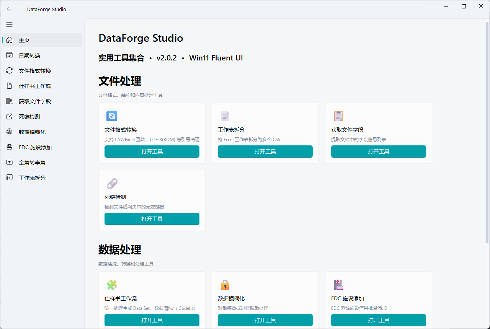
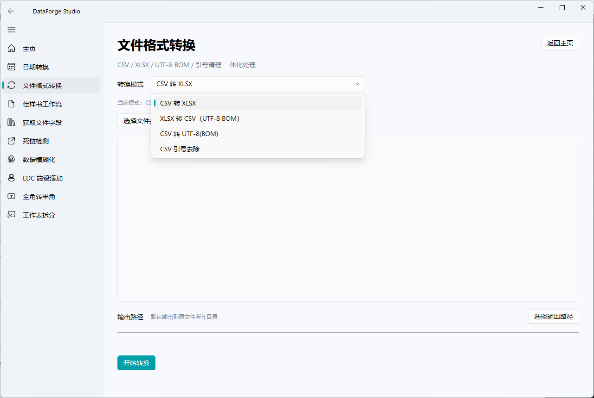
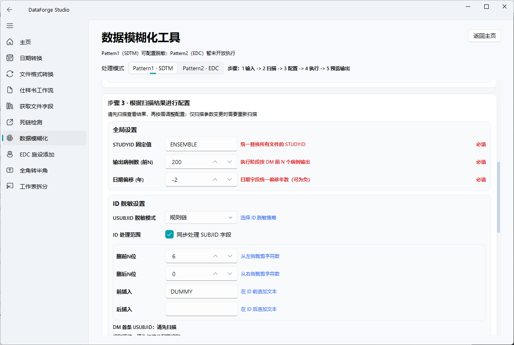
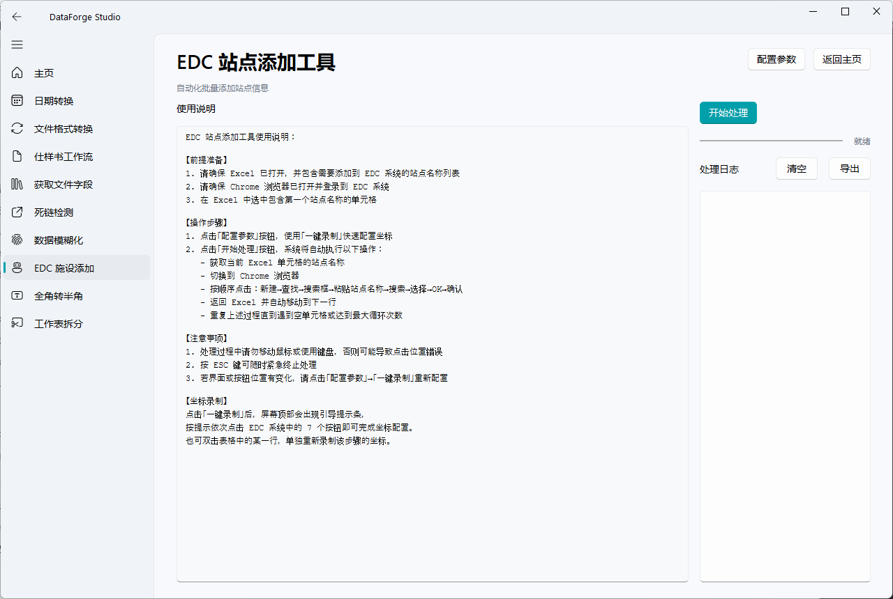

# DataForge Studio

<div align="center">

把零散的数据处理动作，收拢成一套可交付的 Windows 桌面工作台。

`tools_box` 是仓库名，`DataForge Studio` 是产品名。

[](https://www.python.org/)
[](https://doc.qt.io/qtforpython-6/)
[](https://pandas.pydata.org/)
[](https://www.microsoft.com/windows)
[](https://github.com/hakupao/tools_box)
[](https://github.com/hakupao/tools_box)

[下载发布版](https://github.com/hakupao/tools_box/releases) · [快速开始](#快速开始) · [界面预览](#界面预览) · [项目文档](#项目文档) · [更新日志](CHANGELOG.md)

</div>



## 项目定位

DataForge Studio 不是一个为了堆砌功能而做的“工具列表”，而是一个面向真实工作流的桌面数据工具箱。

它关注的不是单次脚本跑通，而是把高频、重复、容易出错的文件处理和数据整理动作，沉淀成一套可复用、可交付、可打包的 Fluent 风格桌面应用：

- 把 CSV / Excel 的格式转换、字段提取、工作表拆分等日常清洗动作统一起来。
- 把仕样书驱动的数据流转做成单入口工作流，而不是拆成分散页面。
- 把 SDTM 数据脱敏和 EDC 重复录入这类偏业务、偏操作型任务产品化。
- 把“服务层逻辑”和“界面交互层”清晰分开，方便持续维护和后续扩展。

如果把它作为个人技术作品来看，这个项目更像是：

- 一个针对真实业务痛点构建的桌面生产力产品。
- 一个以 `PySide6 + QFluentWidgets` 为壳、以 `pandas/openpyxl` 为核心的数据处理工作台。
- 一个强调工程可维护性、批量处理能力和交付体验的 Python GUI 项目。

## 为什么做这个项目

很多团队里的数据处理工作，表面上只是“改个格式”“拆个文件”“跑个清洗规则”，实际上存在几个长期问题：

- 依赖人工操作，重复成本高。
- 规则分散在脚本、Excel 和口口相传的流程里。
- 编码、日期、字段裁剪、导出格式很容易出现细碎但高频的错误。
- 某些动作并不复杂，却因为缺少稳定工具而难以交接或复用。

DataForge Studio 的想法很直接：

> 用一个易用的桌面界面，把这些高频数据动作变成稳定工作流，让“能跑一次”升级成“别人也能稳定重复使用”。

## 项目概览

| 项目项 | 说明 |
| --- | --- |
| 产品名 | `DataForge Studio` |
| 仓库名 | `tools_box` |
| 当前版本 | `v2.0.2` |
| 最近主要更新 | 统一 `仕样书工作流`，优化 `EDC 站点添加` 自动化体验 |
| 技术栈 | Python 3.11, PySide6, QFluentWidgets, pandas, openpyxl |
| 运行平台 | Windows 10 / 11 |
| 体验方式 | 暂无 Web 在线体验，推荐本地运行或下载发布版 |
| 发布形态 | 源码运行、PyInstaller `onedir`、Inno Setup 安装包 |

## 核心能力

| 模块 | 能力说明 | 解决的问题 |
| --- | --- | --- |
| 文件格式转换 | 在一个页面中统一处理 `CSV -> XLSX`、`XLSX -> CSV (UTF-8 BOM)`、`CSV -> UTF-8 BOM`、`CSV 引号清理` | 避免为多个小任务维护多套脚本或多个入口 |
| 工作表拆分 | 将 Excel 工作表拆分为多个 CSV，并保持统一导出规范 | 处理多 sheet 文件时减少手工整理 |
| 获取文件字段 | 批量读取 CSV / XLSX 字段并导出汇总 | 做字段盘点、结构核对更快 |
| 死链检测 | 对 HTML 文件或目录进行链接扫描并生成报告 | 交付前自检页面链接质量 |
| 仕样书工作流 | 单页面切换生成 Data Set、数据清洗、Codelist 处理 | 将规则驱动的数据流程集中管理 |
| 数据模糊化 | 面向 SDTM 场景做脱敏、偏移和 ID 规则处理 | 降低隐私数据暴露风险 |
| EDC 站点添加 | 用录制坐标 + 自动回放的方式执行批量录入 | 将重复点击型工作自动化 |
| 日期转换 / 全角转半角 | 处理文本与日期格式细节 | 解决经常打断流程的小问题 |

## 适用场景

- 日常需要频繁处理 CSV / Excel 的数据运营、数据管理或实施角色。
- 需要按固定仕样书或映射规则批量生成、清洗和标准化文件。
- 需要在交付前做字段检查、格式修整、编码统一和简单质检。
- 需要对临床或业务数据进行脱敏处理，降低人工操作失误。
- 需要把重复性强、步骤固定的系统录入动作沉淀为可复用工具。

## 界面预览

顶部预览图展示了首页总览。下面是三个更能体现项目特点的代表性工具页面。

| 文件格式转换 | 数据模糊化 | EDC 站点添加 |
| --- | --- | --- |
|  |  |  |

## 这个项目的技术亮点

- `UI` 和 `业务服务` 分层明确，页面逻辑主要放在 `src/gui/widgets/*_page.py`，数据处理能力集中在 `src/utils/*_service.py`。
- 保持桌面产品思路而不是脚本堆叠，首页、导航、卡片分组和单页多模式切换都经过统一设计。
- 对文件处理约定做了稳定化处理，例如 CSV / Excel 读取写出、UTF-8-SIG 导出、规则驱动的清洗流程。
- 有意识地把复杂流程产品化，例如：
  - `仕样书工作流` 把多条数据处理链路合并为统一入口。
  - `数据模糊化` 提供扫描、配置、执行、预览的完整链路。
  - `EDC 站点添加` 支持一键录制、回放测试、进度反馈与日志导出。
- 保留打包与安装链路，说明这个项目不是只面向开发者使用，也考虑了分发和落地。

## 技术架构

```text
src/
├── main.py                        # 程序入口
├── gui/
│   ├── main_window.py            # 主窗口、导航与首页
│   ├── qt_common.py              # 对话框、文件选择等 GUI 公共封装
│   └── widgets/                  # 各功能页面
└── utils/                        # 业务服务、文件处理与规则实现
```

架构上的核心思路是：

- 在 GUI 层处理交互、状态和提示。
- 在 Service 层处理转换、清洗、规则映射和导出。
- 通过统一页面风格、统一导出约定和统一打包链路，让多个小工具保持一致体验。

## 快速开始

### 环境要求

- Python `3.11`
- Windows `10 / 11`

### 本地运行

```bash
python -m venv .venv
.\.venv\Scripts\activate
pip install -r requirements.txt
python src/main.py
```

### 运行测试

```bash
python -m unittest discover -s tests
```

如果只想快速验证核心回归，当前更适合优先跑：

```bash
python -m unittest tests.test_data_masking_service
python -m unittest tests.test_unified_config_services
```

## 打包与发布

推荐使用 `onedir` 构建，它更适合作为实际交付版本。

### 构建 onedir

```powershell
powershell -ExecutionPolicy Bypass -File .\packaging\scripts\build_onedir.ps1 -Clean
```

### 构建安装包

```powershell
powershell -ExecutionPolicy Bypass -File .\packaging\scripts\build_installer.ps1 -Clean
```

### 测量启动速度

```powershell
powershell -ExecutionPolicy Bypass -File .\packaging\scripts\measure_startup.ps1
```

## 项目文档

- [用户手册](docs/用户手册.md)
- [开发文档](docs/开发文档.md)
- [API 文档](docs/API文档.md)
- [UI 界面规范](docs/UI界面规范.md)
- [XLSX 文件制作规范](docs/XLSX文件制作规范.md)
- [打包说明](packaging/README.md)
- [更新日志](CHANGELOG.md)

## 仓库结构

```text
tools_box/
├── src/                    # 应用源码
├── tests/                  # unittest 风格测试
├── docs/                   # 用户手册、开发文档、界面规范
├── packaging/              # PyInstaller / Installer / 启动测速脚本
├── assets/                 # 应用图标等资源
├── CHANGELOG.md
└── README.md
```

## 仓库展示建议

如果你是通过 GitHub 首页看到这个项目，建议从下面三个入口开始：

1. 先看 [界面预览](#界面预览)，理解它是一个怎样的桌面产品。
2. 再看 [核心能力](#核心能力) 和 [适用场景](#适用场景)，判断它解决的是不是你所在流程里的问题。
3. 最后进入 [开发文档](docs/开发文档.md) 或直接本地运行，查看代码组织和实现方式。

## 说明

- 本项目当前没有提供 Web 在线 Demo，因为它是一个以 Windows 桌面交互为核心的应用。
- 当前仓库尚未附带 `LICENSE` 文件；如果计划进一步对外开源分发，建议补充明确许可协议。
